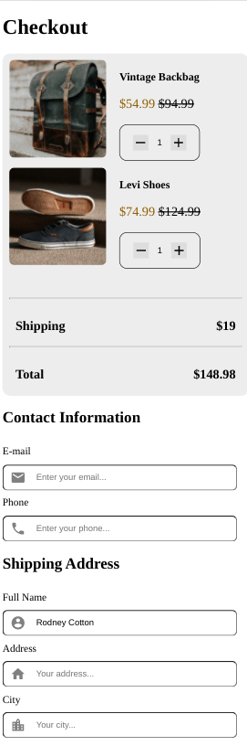
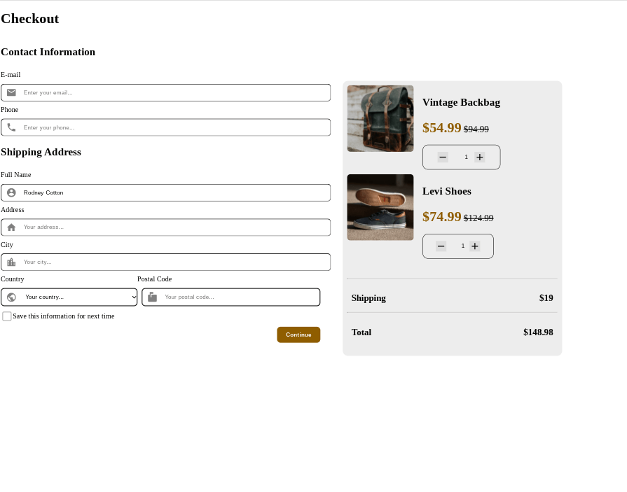
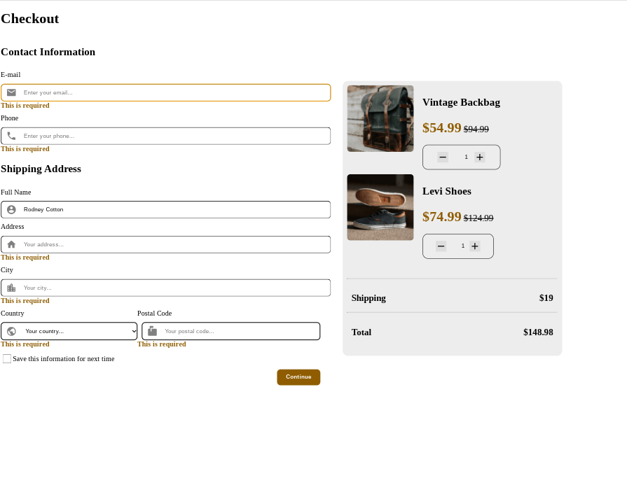

<h1 align="center">Checkout Page</h1>

   Solution for a challenge from  <a href="http://devchallenges.io" target="_blank">Devchallenges.io</a>.

  <h3>
    <a href="https://jdegand.github.io/checkout-page">
      Live Link
    </a>
     | 
    <a href="https://legacy.devchallenges.io/challenges/0J1NxxGhOUYVqihwegfO">
      Challenge
    </a>
  </h3>

## Table of Contents

- [Overview](#overview)
  - [Built With](#built-with)
- [Features](#features)
- [Requirements](#requirements)
- [Useful Resources](#useful-resources)

## Overview

Orange is a difficult color to make pass accessibility contrast tests.

Obviously, to build this out completely, you would probably need redux or state management.  The form would have more validation as well.  React Hook Form implementation is quite minimal.  I have been meaning to look into it and I used this project as an excuse.

Could separate component css into own files.

To add a background to the arrow of the select box is a ton of work (vs what it adds) and a minefield of accessibility concerns.

### Built With

- [React](https://reactjs.org/)
- [React-Hook-Form](https://react-hook-form.com/)

## Features

This application/site was created as a submission to a [DevChallenges](https://devchallenges.io/challenges) challenge. The [challenge](https://legacy.devchallenges.io/challenges/0J1NxxGhOUYVqihwegfO) was to build an application to complete the given user stories.

## Requirements

- [x] I can see a page following the given design
- [x] I can input email, phone, full name, address, city, country, and postal code
- [x] I can input the number of items
- [x] I can select at least 3 countries from the dropdown
- [x] When I click submit button or press enter, I can see a warning if validation fails
- [x] When I click submit button or press enter, I can see a successful alert if validation succeeds

## Useful Resources

- [Steps to replicate a design with only HTML and CSS](https://devchallenges-blogs.web.app/how-to-replicate-design/)
- [PluralSight](https://www.pluralsight.com/guides/handling-multiple-inputs-with-single-onchange-handler-react) - onChange
- [W3](https://www.w3.org/WAI/tutorials/forms/labels/) - hiding labels
- [All Time Power](https://www.alltimepower.com/blog/react-hook-forms-custom-checkbox/) - custom checkbox
- [Geeks for Geeks](https://www.geeksforgeeks.org/css-to-put-icon-inside-an-input-element-in-a-form/) - icon inside input
- [Stack Overflow](https://stackoverflow.com/questions/40920945/react-warning-unknown-prop-valueasnumber-on-input-tag) - valueAsNumber & React
- [Modern CSS](https://moderncss.dev/custom-select-styles-with-pure-css/) - custom select box
- [24a11y](https://www.24a11y.com/2019/select-your-poison/) - custom selects
- [YouTube](https://www.youtube.com/watch?v=ug1elgso_8A) - accessbile custom selects
- [Stack Overflow](https://stackoverflow.com/questions/3532649/problem-with-select-and-after-with-css-in-webkit) - select and pseudo elements
- [Style Lint](https://stylelint.io/) - Style Linting - CSS Lint website is out of date and this might be a good alternative
- [Stack Overflow](https://stackoverflow.com/questions/16699007/regular-expression-to-match-standard-10-digit-phone-number) - regex for us phone numbers
